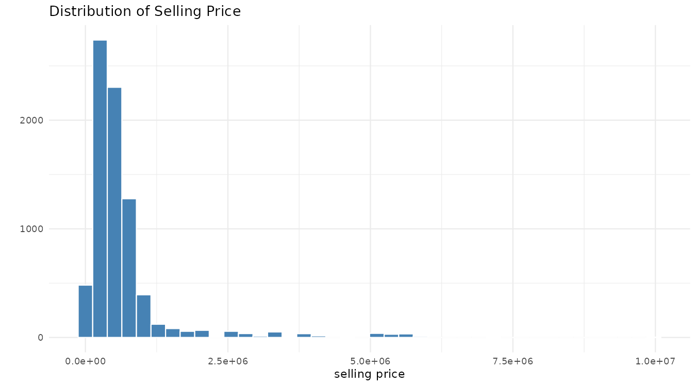
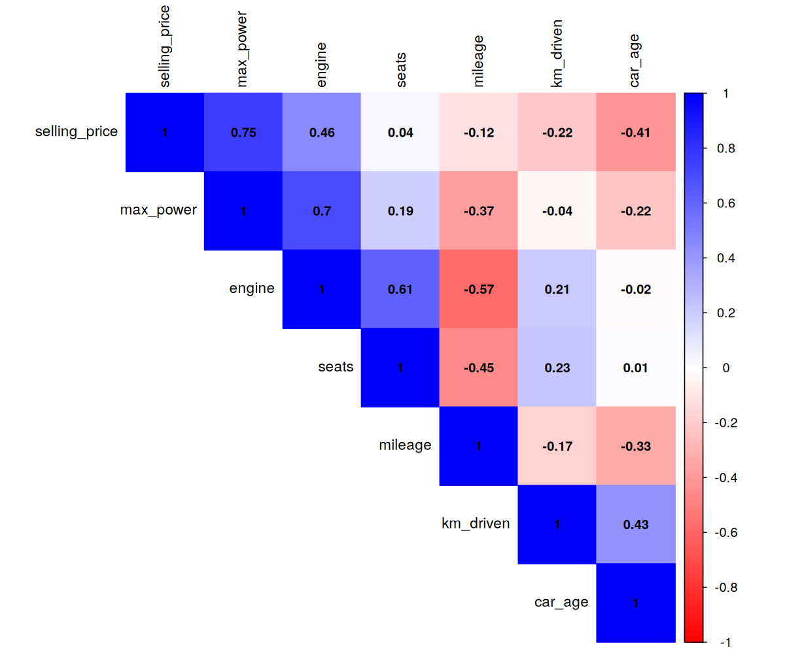
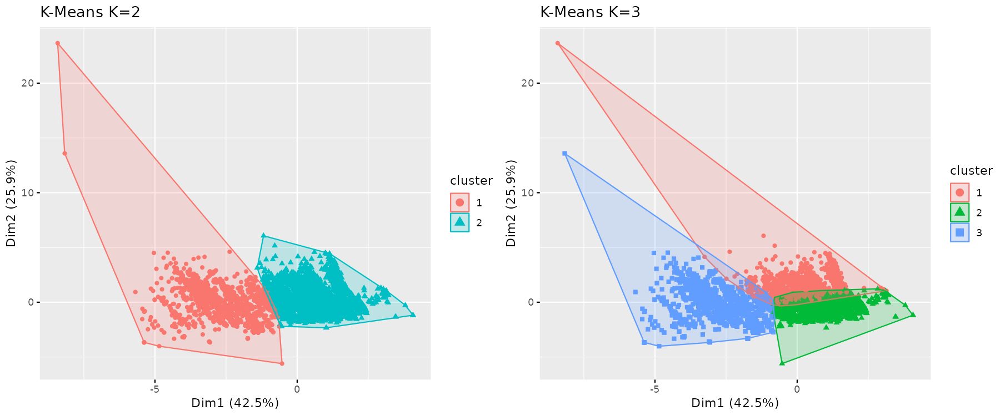
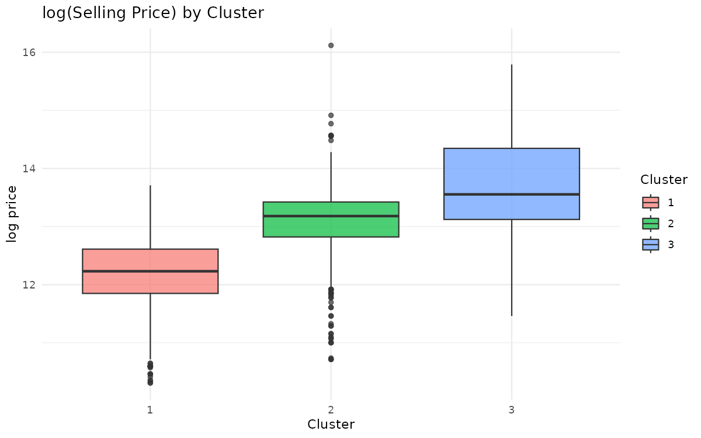

# Used Car Price Analysis — Regression & Clustering

Statistical learning analysis of a used-car marketplace dataset in **R**: what drives resale prices, and what natural segments exist in the market? Final project for the *Statistics and Machine Learning* course (B.Sc. Digital Economics and Business, Università Politecnica delle Marche).

## Approach

The project combines a **supervised** and an **unsupervised** technique on the same dataset:

### 1. Linear regression on log(price)

- Cleaned raw listing data: parsed numeric values out of text fields ("23.4 kmpl", "74 bhp"), engineered `car_age` and `brand` features, removed unstable factor levels
- Modelled `log(selling_price)` — the log transform corrects the strong right skew of prices
- **Forward selection** built up from the strongest predictors; **stepwise selection (AIC)** run on the full model for comparison; models compared on adjusted R² and AIC
- Full residual diagnostics on the final model:
  - Shapiro–Wilk (normality of residuals)
  - VIF (multicollinearity)
  - Breusch–Pagan (heteroscedasticity)
  - Durbin–Watson (autocorrelation)
  - Residuals-vs-fitted and Q–Q plots, fitted-vs-actual

### 2. Market segmentation (PCA + clustering)

- **PCA** on standardised car characteristics (price deliberately excluded, so segments are defined by the cars themselves — price is then profiled across segments)
- Component retention by the Kaiser criterion; variable contributions and correlation circle visualised
- Optimal number of clusters chosen by **elbow**, **silhouette**, and **NbClust** (26 indices)
- **K-Means** (K=2 and K=3, compared by BSS/TSS) and **hierarchical clustering** (complete linkage and Ward's method, with dendrograms)
- Cluster profiling: average characteristics and price distribution per segment; internal validation with `clValid`

## Tools

`R` · `dplyr` · `ggplot2` · `FactoMineR` · `factoextra` · `NbClust` · `cluster` · `dendextend` · `car` · `lmtest` · `corrplot`

## Highlights

*Selling price is strongly right-skewed — the model therefore targets log(price).*

*Correlations among the numeric features.*

*K-Means segmentation of the market (K=2 vs K=3) in PCA space.*

*log(price) distribution across the discovered segments — the clusters separate cheap high-mileage cars from newer, more powerful ones.*

## How to run

1. Clone the repository
2. Put the dataset at `data/cars.csv`
3. Run `car_price_analysis.R` — the script is organised in numbered sections (setup → cleaning → EDA → regression → clustering) and prints all results and plots

## Author

**Yonatan Lewetegn Hassen** — B.Sc. Digital Economics and Business, Università Politecnica delle Marche
